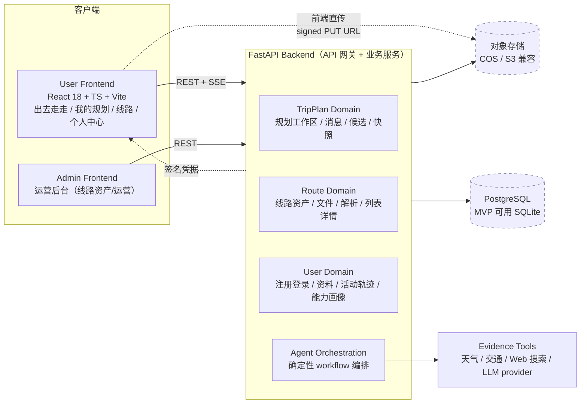
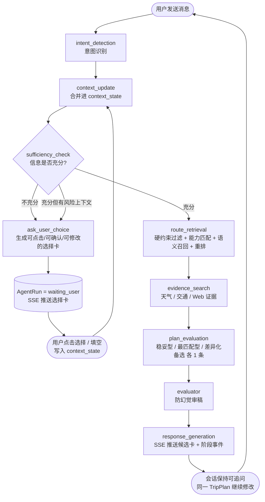
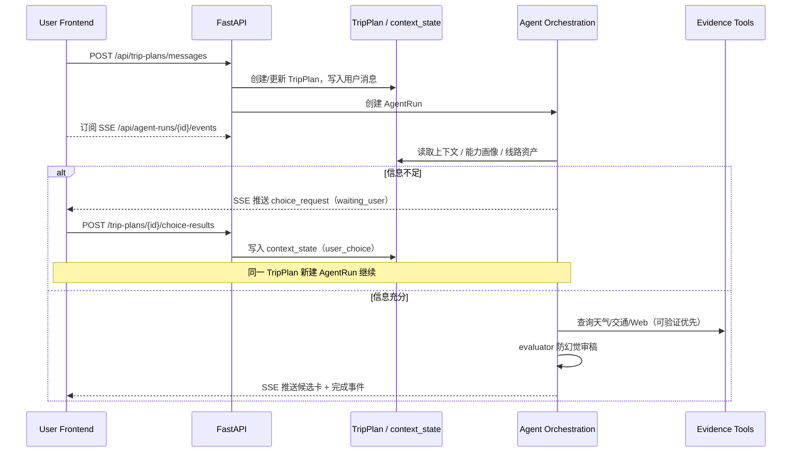
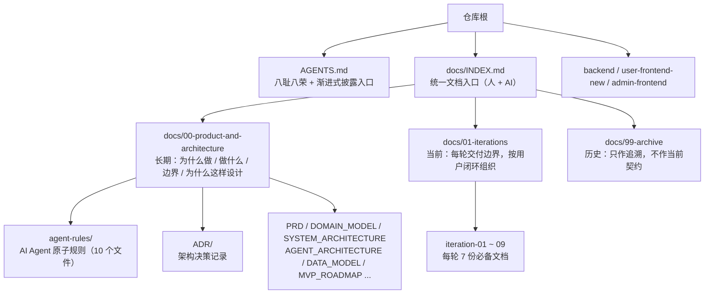
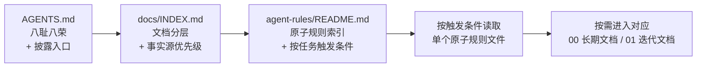

# 智行户外 Smart_outdoor

> 任务驱动的智能户外规划 Agent：把用户一句模糊的「周末想看雪山但别太累」，变成带证据、可保存、可回看的真实线路方案。

Status: active · 架构与迭代事实源见 [`docs/`](./docs/INDEX.md) · 文档驱动开发 + 敏捷切片交付

---

## 这是什么

智行户外面向轻中度户外用户（大学生、大众徒步者、日常出游人群），解决三个真问题：

- **不知道去哪** —— 种草强的不专业，专业的少风景/交通/天气/近期信息。
- **不知道能不能走** —— 距离、爬升、海拔等指标难和自身体能匹配。
- **不知道是否可成行** —— 天气、交通、返程、近期路况散落在多个 App 和网页。

差异化不是「更强的通用聊天机器人」，而是 **结构化轨迹资产 + 多源证据验证 + 基于真实完成轨迹的人线匹配**，并以 **可保存、可分享的规划工作区** 替代一次性问答。

> 本 README 聚焦两条主线：**Agent 设计** 与 **文档管理**。完整产品/架构/迭代事实源见 [`docs/INDEX.md`](./docs/INDEX.md)。

---

## 系统架构

前后端分离的移动端 H5 架构，核心是 **有状态的规划 Agent**，而非单个黑盒聊天接口。



**设计原则**

- 有状态规划工作区，不做一次性聊天机器人。
- 确定性 workflow 编排，不把业务边界交给自由 Agent。
- 真实线路资产优先，不虚构路线。
- API 契约优先，前端类型从 OpenAPI 生成。
- Mock / Real 通过环境变量切换，不改页面代码。

详见 [`SYSTEM_ARCHITECTURE.md`](./docs/00-product-and-architecture/SYSTEM_ARCHITECTURE.md)。

---

## Agent 设计

Agent 的职责是把 **自然语言、规划上下文、线路资产库、能力画像、外部证据** 转化为：自然追问、候选线路、候选详情、风险提示、证据说明、可保存的快照。它是**受控 workflow**，不是无边界自由聊天。

### 固定 Workflow

每条用户消息创建一个 `AgentRun`，跑一条确定性流水线：



> 系统级节点序列在 V1/V2 保持一致；choice-based 收敛只在 `trip_plans` 模块内增强（[ADR-0003](./docs/00-product-and-architecture/ADR/0003-choice-based-agent.md)）。

### Choice-based 需求收敛（Agent V2，Iteration 08）

V1 一次性从自然语言抽取需求倾向再直接推荐，**猜错风险高**，`evaluator` 只能事后防幻觉。V2 把不确定信息转成**选择卡**逐步收敛，把防幻觉**前移到用户确认环节**：

- `ask_user_choice` 工具单轮最多 3 个问题，每问给预设选项并允许自定义补充；前端逐步呈现（单题翻页），不一次性铺满。
- 用户选择直接写入 `context_state`，写入可信度优先级：**`user_choice` > `user_explicit_text` > `ai_extracted`** —— 已确认字段 AI 不得静默覆盖。
- `is_sufficient` 达标才进入线路召回；`has_risk_context`（雪、野路、亲子等）**强制额外确认路况 / 安全偏好**。
- 同一 `TripPlan` 会话内可连续多轮选择并修改，无需重开会话。
- 能力强弱优先来自**用户能力画像**；本轮对话里的强度偏好只作偏好或覆盖项。

### 防幻觉底线

Agent 只能基于三类事实：**数据库已有信息 / API 明确返回 / Web 搜索明确返回且带 URL**。无证据内容必须降级表达（「未确认 / 证据不足 / 建议出发前核实」）。**禁止**「放心去 / 一定适合 / 路况很好 / 绝对安全」这类绝对话术。

详见 [`AGENT_ARCHITECTURE.md`](./docs/00-product-and-architecture/AGENT_ARCHITECTURE.md) 与 [`agent-rules/60-agent-workflow-safety.md`](./docs/00-product-and-architecture/agent-rules/60-agent-workflow-safety.md)。

### 一次交互的完整时序



---

## 文档管理

项目采用 **docs-as-code + 文档驱动开发 + 敏捷切片交付**：文档和代码在同一仓库，接口/数据库/Agent workflow/测试策略变化时，文档必须在**同一轮任务**中同步更新。

### 分层结构



每一轮迭代必须独立验收，必备 7 份文档：`README / USER_STORIES / API_CONTRACT / DATABASE_DESIGN / TEST_PLAN / ACCEPTANCE_CRITERIA / DELIVERY_NOTES`。

### 渐进式披露：不要一次塞满上下文

规则按需加载，避免长任务上下文过载或遗忘。读取链路：



`agent-rules/` 把规则拆成 10 个原子文件，每个只负责一类规范，按任务类型触发（例如「改接口」读 `30-api-contracts`，「户外安全表达」读 `60-agent-workflow-safety`）。`AGENTS.md` 只保留最高优先级的八耻八荣和入口指针，细则不堆进顶层。

### 单一事实源 + 冲突优先级

禁止为同一件事维护多份互相复制的长文档；禁止 `_v1`/`_v2` 并行；禁止用聊天记录替代 ADR。当文档冲突，按以下顺序判断：

1. 已实现代码、测试、Pydantic Schema、FastAPI OpenAPI 输出
2. `docs/01-iterations` 当前迭代文档
3. `docs/00-product-and-architecture` 长期架构和 ADR
4. `docs/99-archive` 历史设计文档
5. `design_doc` 中 PRD、图、演示材料

**PRD 表达产品愿景，MVP 迭代文档表达当前实现边界 —— 不得仅凭 PRD 扩展 MVP 范围。**

### ADR 纪律

技术栈取舍、数据模型边界、Agent workflow 关键策略、Mock/Real 切换、安全/证据约束变化时必须新增 ADR。已接受 ADR 不回改历史结论，新决策新增 ADR 并标记 `supersedes`。当前已记录：

| ADR | 决策 |
|---|---|
| [0001](./docs/00-product-and-architecture/ADR/0001-documentation-structure.md) | 文档分层结构（00 长期 / 01 迭代 / 99 归档 + INDEX 入口） |
| [0002](./docs/00-product-and-architecture/ADR/0002-object-storage.md) | 对象存储（前端直传 + 后端签名，DB 只存 provider+key） |
| [0003](./docs/00-product-and-architecture/ADR/0003-choice-based-agent.md) | Choice-based 需求收敛（Agent V2） |

详见 [`DOCUMENTATION_STANDARD.md`](./docs/00-product-and-architecture/DOCUMENTATION_STANDARD.md) 与 [`agent-rules/10-documentation-governance.md`](./docs/00-product-and-architecture/agent-rules/10-documentation-governance.md)。

---

## 技术栈

```text
Frontend  React 18 + TypeScript + Vite + Tailwind CSS（user-frontend-new / admin-frontend）
Backend   FastAPI + Python 3.10+，pyproject.toml，入口 backend/app/main.py
Database  PostgreSQL 16（docker-compose 默认）；MVP 可降级 SQLite，不引入 PostGIS/pgvector 除非 ADR 升级
Storage   对象存储（COS/S3 兼容），前端直传 + 后端签名
Deploy    Docker + Docker Compose（postgres / backend / nginx 三服务）
```

Agent 跑在 `backend/app/features/`：`agent_tools/`（工具，如 `ask_user_choice`）、`trip_plans/`（规划工作区、`context_state`、选择卡逻辑）、`llm/`（LLM provider，mock/real 可切换）、`routes/`、`geo/`、`storage/`、`auth/`、`users/`。测试按相同结构在 `backend/tests/` 下，用 `pytest` 运行。

---

## 快速开始

```bash
# 后端（API + 测试）
cd backend
python -m venv .venv && source .venv/bin/activate   # Windows: .venv\Scripts\activate
pip install -e ".[dev]"
pytest                                                # 跑测试
uvicorn app.main:app --reload                         # 起后端

# 用户前端
cd user-frontend-new
npm install && npm run dev                            # http://localhost:3000

# 一键起整套（postgres + backend + nginx）
docker compose up -d --build
```

> 后端运行密钥、对象存储凭据、mock/real 切换等见 `backend/.env`（不入库）和 [`agent-rules/80-runtime-secrets.md`](./docs/00-product-and-architecture/agent-rules/80-runtime-secrets.md)。

---

## 迭代进度

按用户闭环切片，每轮独立验收。

| # | 用户闭环 | 文档状态 |
|---|---|---|
| 01 | Auth + User（注册/登录/资料） | active |
| 02 | Route Upload + Parser（GPX/KML/GeoJSON 解析） | active |
| 03 | Route List + Detail（线路卡片 + 地图渲染） | active |
| 04 | TripPlan + Agent Mock（消息 → SSE → 3 条候选） | active |
| 05 | Snapshot / 我的规划（候选保存为快照） | active |
| 06 | Ability Profile（完成轨迹 → 能力画像） | active |
| 07 | Object Storage + Image Assets（统一存储 + 前端直传） | active（DELIVERY_NOTES: implemented） |
| 08 | Agent V2 Choice-based 需求收敛（选择卡 + context_state） | draft（ADR-0003 accepted，已实现） |
| 09 | Tag Knowledge Base + RAG 辅助选择卡 | draft（对齐阶段） |

详见 [`MVP_ROADMAP.md`](./docs/00-product-and-architecture/MVP_ROADMAP.md) 与 [`docs/01-iterations/`](./docs/01-iterations/README.md)。

---

## 给 AI Agent 与协作者

无论你是人还是 AI coding agent，开工前按链路读：[`AGENTS.md`](./AGENTS.md) → [`docs/INDEX.md`](./docs/INDEX.md) → [`agent-rules/README.md`](./docs/00-product-and-architecture/agent-rules/README.md) → 任务相关原子规则与迭代文档。不确定接口/字段/业务规则时先查代码、Schema、OpenAPI、测试和迭代文档，不要瞎猜；用户目标或业务边界不清时先向人类确认。新增规则、教训、约束按落点分流，不堆进 `AGENTS.md`。

---

## License

私有项目，未公开发布。
