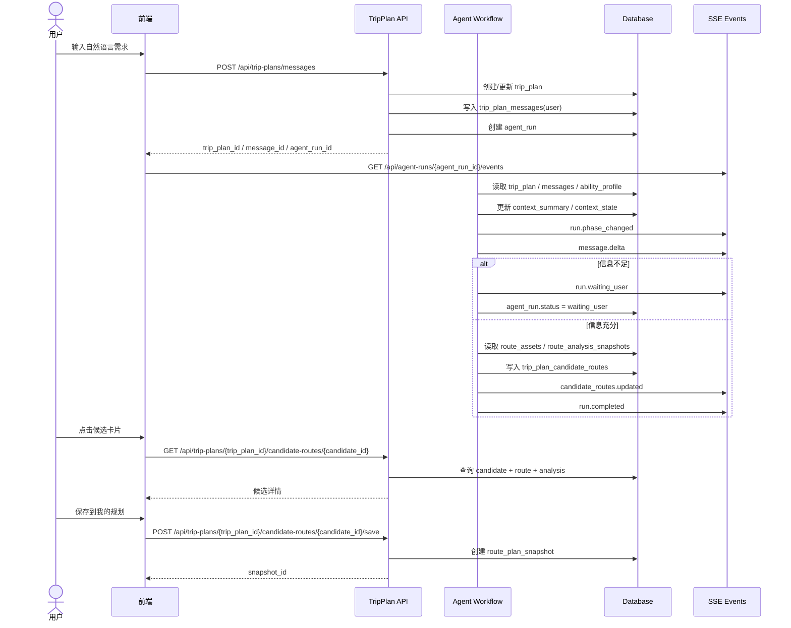
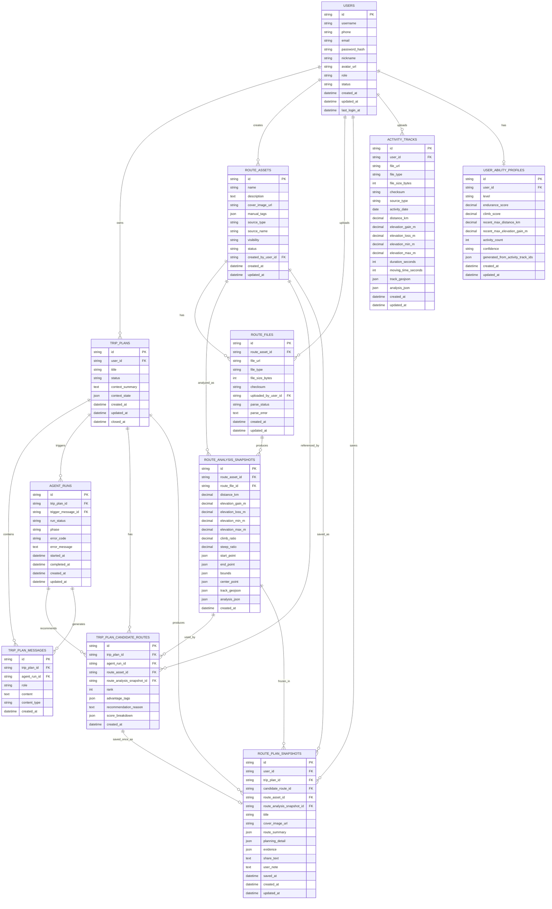
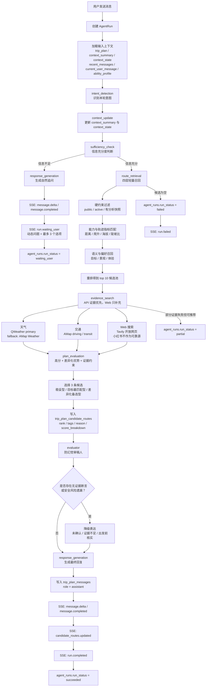
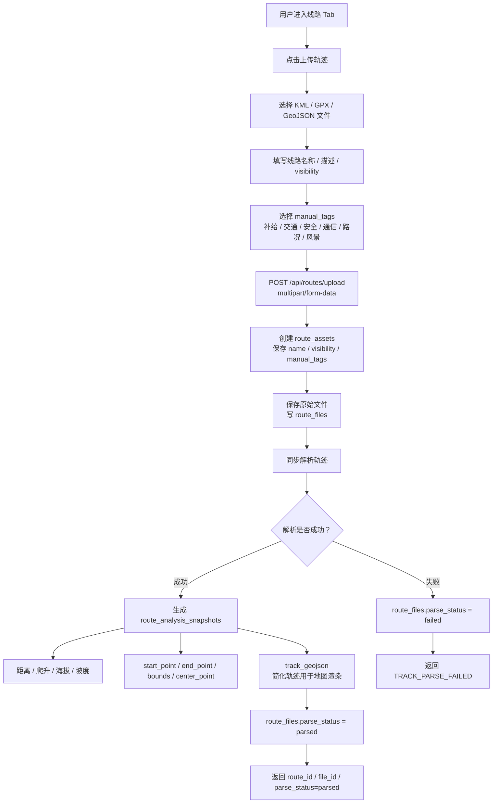
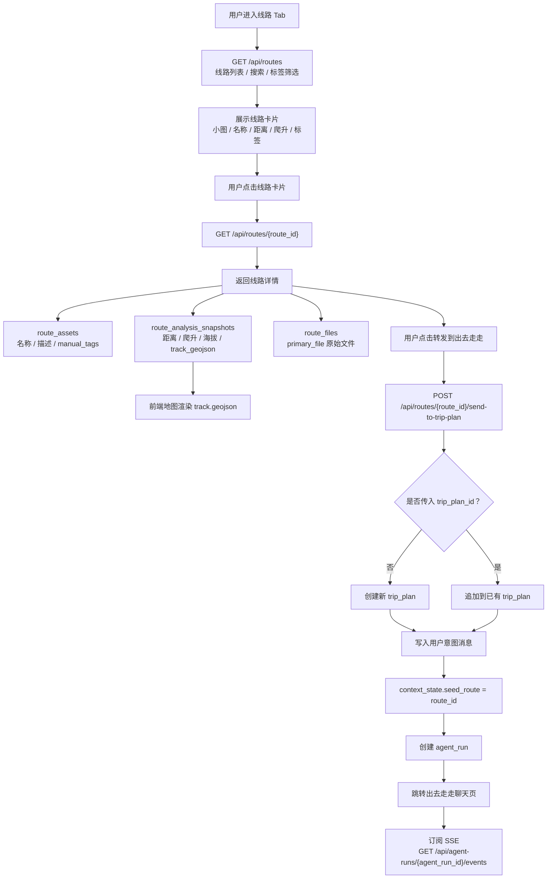
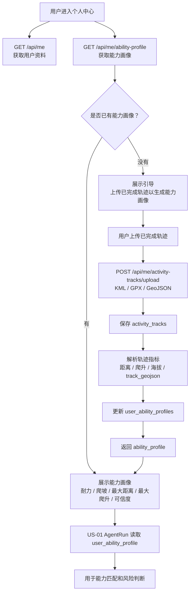
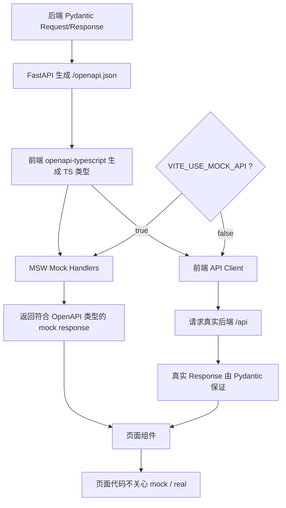

下面是从 API / 数据库设计之后，目前应该保留的 Mermaid 图。

**1. US-01 API 主流程**

**2. US-01 / US-02 / US-03 ER 图**

**3. US-01 Agent Workflow**

**4. US-03 线路上传与解析流程**

**5. US-03 线路详情与转发规划**

**6. US-02 个人中心与能力画像**

**7. Mock / Real 契约驱动对接**

