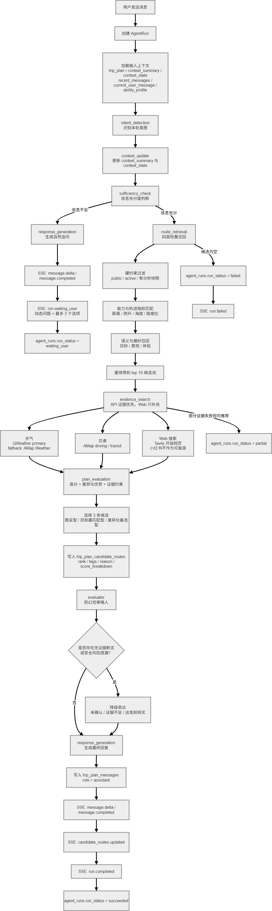

# Agent 架构

Status: active
Owner: project maintainer
Last reviewed: 2026-05-08
Source of truth: migrated from PRD AI architecture and `docs/99-archive/backend-docs-legacy/US-01_AGENT_WORKFLOW.md`.

## 定位

Agent 负责把用户自然语言、规划上下文、线路资产库、能力画像和外部证据转化为：

```text
自然追问
候选线路
候选详情
风险提示
证据说明
可保存快照内容
```

它不是无边界自由聊天机器人，而是受控 workflow。

## 状态机与流程图

来源图：




## AgentRun 输入

每次用户发送消息后创建一个 AgentRun。输入包含：

```text
trip_plan
context_summary
context_state
recent_messages
current_user_message
user_ability_profile
```

## 固定 Workflow

```text
intent_detection
→ context_update
→ sufficiency_check
→ route_retrieval
→ evidence_search
→ plan_evaluation
→ evaluator
→ response_generation
```

## 节点职责

### intent_detection

识别用户本轮意图：

```text
new_requirement
provide_info
modify_constraint
compare_candidates
ask_detail
casual
```

### context_update

把用户新消息合并进：

```text
trip_plans.context_summary
trip_plans.context_state
```

### sufficiency_check

判断是否达到推荐条件。信息不足时进入自然追问，信息充分时进入线路召回。

### route_retrieval

从线路资产库召回候选：

```text
硬约束过滤
能力与轨迹指标匹配
语义/偏好召回
重排得到候选池
```

MVP 不引入向量库，先用轻量规则和标签/文本匹配。

### evidence_search

补充天气、交通、Web 证据。

证据策略：

```text
API 可验证信息优先
Web 搜索只做补充
证据不足必须明确说明
```

### plan_evaluation

从候选池选择 3 条差异化推荐：

```text
稳妥型
目标最匹配型
差异化备选型
```

### evaluator

防幻觉审稿节点。检查：

```text
无证据断言
近期路况幻觉
天气/交通来源缺失
能力不匹配风险
绝对安全话术
推荐理由是否有依据
```

### response_generation

只负责表达和 SSE 推送，不重新推荐、不重新判断。

## 防幻觉底线

Agent 只能基于：

```text
数据库已有信息
API 明确返回的信息
Web 搜索明确返回且带 URL 的信息
```

无证据内容必须降级表达：

```text
未确认
证据不足
建议出发前核实
```

禁止：

```text
放心去
一定适合
路况很好
最近很多人走过
绝对安全
```

