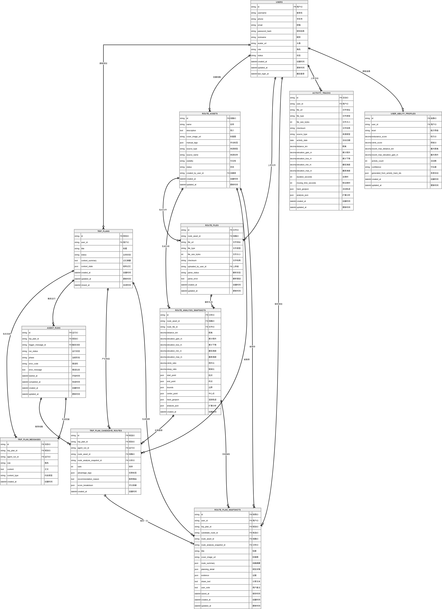

# 数据模型

Status: active
Owner: project maintainer
Last reviewed: 2026-05-08
Source of truth: migrated from `docs/99-archive/backend-docs-legacy/US-01_DATABASE_DESIGN.md` and ER diagrams; ORM models are final implementation source.

## ER 图

来源图：



Mermaid 来源：

```text
docs/99-archive/backend-docs-legacy/US-01_ER_DIAGRAM.mmd
```

## 核心关系

```text
users 1:N trip_plans
users 1:N route_assets
users 1:N route_plan_snapshots
users 1:N activity_tracks
users 1:1 user_ability_profiles

trip_plans 1:N trip_plan_messages
trip_plans 1:N agent_runs
trip_plans 1:N trip_plan_candidate_routes
trip_plans 1:N route_plan_snapshots

route_assets 1:N route_files
route_assets 1:N route_analysis_snapshots
route_assets 1:N trip_plan_candidate_routes
route_assets 1:N route_plan_snapshots

route_files 1:N route_analysis_snapshots
trip_plan_candidate_routes 1:0..1 route_plan_snapshots
```

## 表分组

### 用户与能力

```text
users
activity_tracks
user_ability_profiles
```

### 线路资产

```text
route_assets
route_files
route_analysis_snapshots
```

### 对话规划

```text
trip_plans
trip_plan_messages
agent_runs
trip_plan_candidate_routes
route_plan_snapshots
```

## MVP 存储取舍

MVP 使用简单鲁棒设计：

```text
JSON 保存 context_state、manual_tags、analysis_json、track_geojson、evidence
不提前引入 JSONB 内部字段查询
不提前引入 PostGIS geometry
不提前引入 pgvector
```

升级条件：

```text
需要按 JSON 内部字段查询或统计 -> 考虑 JSONB 和索引
需要附近线路、范围检索、地图框选 -> 考虑 PostGIS
需要语义召回规模化 -> 考虑 pgvector
```

## 不可违反的数据边界

```text
route_asset 不是 activity_track
trip_plan_candidate_route 不是 route_plan_snapshot
route_file 保存原始文件
route_analysis_snapshot 保存可用指标和 track_geojson
snapshot 保存当时规划内容，不随 route_asset 自动变化
```

